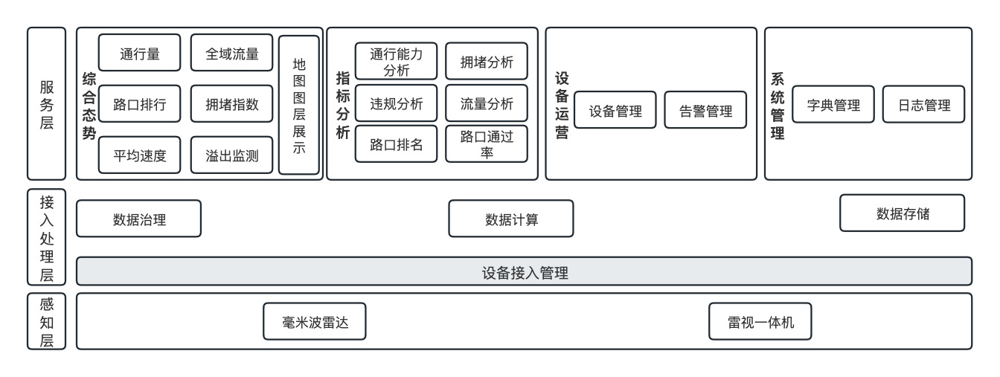
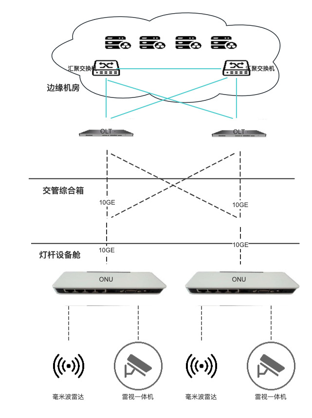
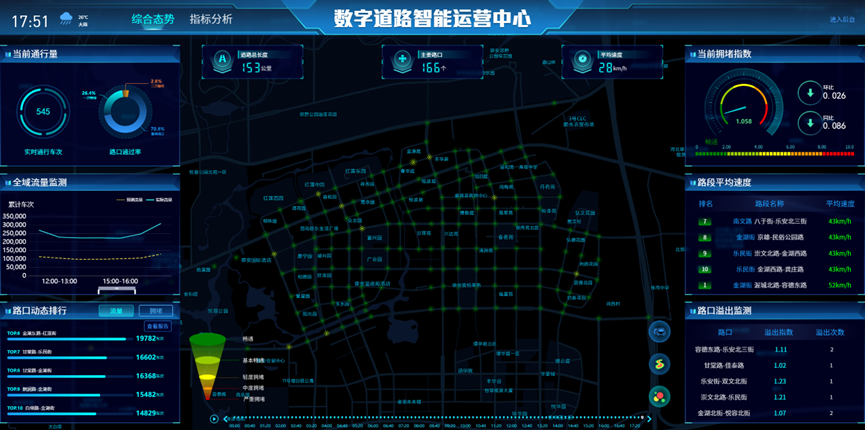
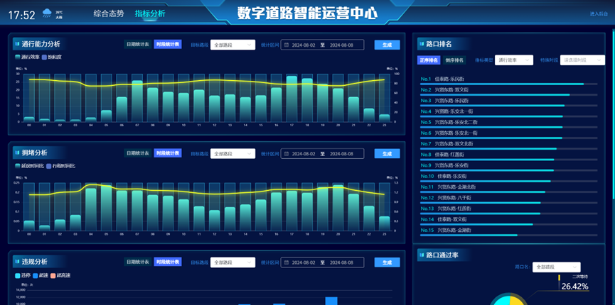
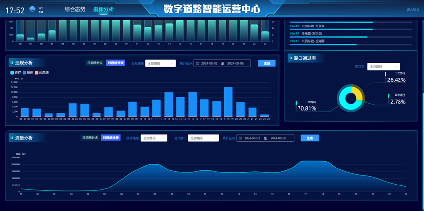
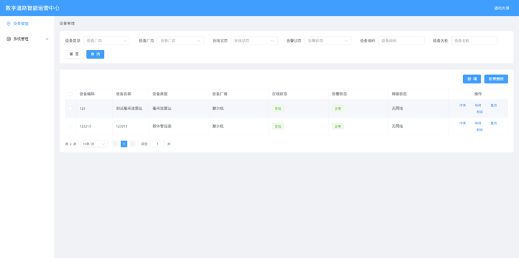
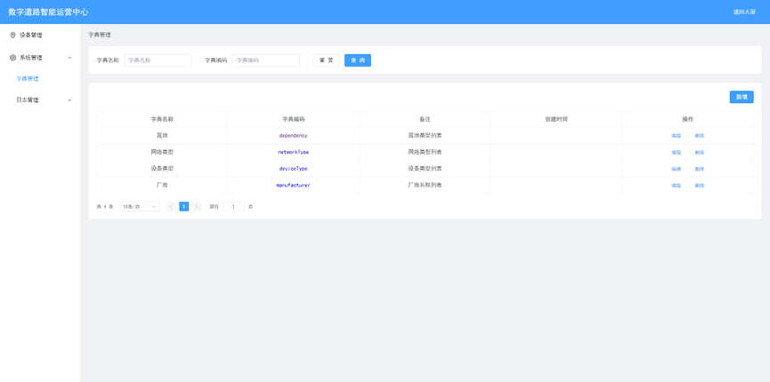
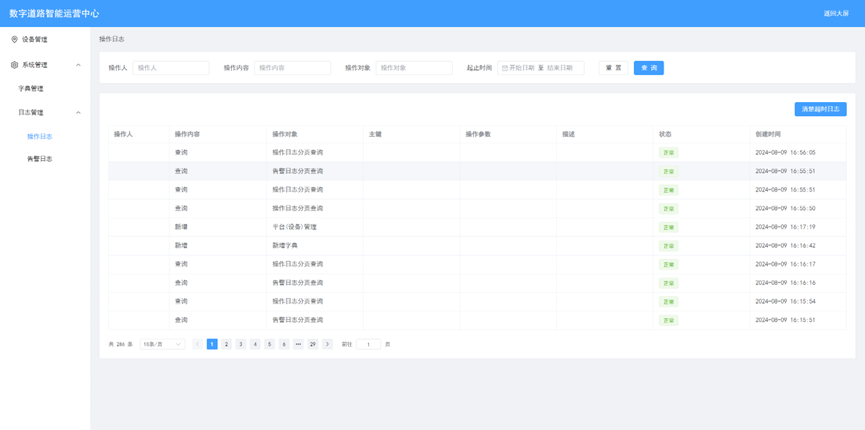

# 数字道路-路侧设备管理与数据分析系统(面向交通设施全周期管理的数字交通平台建设；课题所属项目：雄安新区交通设施数字化建设示范应用)


##  系统简介
> 本系统通过物联网协议对接路侧毫米波雷达、雷视一体机设备，实现设备状态实时监控、指令配置下发和数据采集。采集车轨迹、过车信息、交通状态、交通流、交通事件等5类事件，数据采集后经过大数据服务数据治理完成处理和分析，完成当前片区交通综合态势分析展示。
## 快速上手
1. docker运行：
   1. 利用项目中Dockerfile制作镜像，或者通过以下链接获取镜像并加载
   ~~~ 
   链接： https://pan.baidu.com/s/1sLFvtYdz0D5DR2nrtaPLzA?pwd=4bz9
   ~~~
   加载脚本如下
   ```
   # 定义 tar 文件所在目录
   tar_dir="./tar"
   
   # 进入 tar 文件所在目录
   cd "$tar_dir" || exit
   
   # 加载所有 tar 包
   for file in *.tar; do
   echo "Loading $file..."
   docker load -i "$file"
   done
   ```
   2. 安装项目依赖： docker、JDK8、nacos、Mysql、Redis、RabbitMq、Kafka、mqtt服务器等
   3. 在各个项目下的配置文件中将依赖的地址改为正确的地址，在mysql中创建数据库，依次运行doc/sql包下ddl.sql、all.sql文件，导入数据
   4. 编辑项目目录下的bin/docker-run.cmd脚本，修改数据库配置，运行脚本启动项目。
2. 本地运行
   1. 安装项目依赖 docker、JDK8、nacos、Mysql、Redis、RabbitMq、Kafka、mqtt服务、Maven、Flink、Spark、Python3、NodeJs等
   2. 在各个项目下的配置文件中将依赖的地址改为正确的地址，在mysql中创建数据库，依次运行doc/sql包下ddl.sql、all.sql文件，导入数据
   3. 按【data-dev服务启动脚本.txt】脚本启动数据服务，运行start.cmd脚本启动项目。
## 系统功能清单
1. 设备管理：
   1. 设备路侧毫米波雷达、雷视一体机设备管理和数据采集。
   2. 设备列表展示，设备信息维护和查看
   3. 设备状态监控
   4. 设备指令下发
2. 数据治理：
   1. 实时流量计算，毫米波雷达、雷视融合数据将设备汇总，使用flink组件汇聚转发。
   2. 接入转发数据，spark流批一体计算交通指标，包含车流量、饱和度、车流密度、车头时距、空间占有率、一次通过率、二次通过率、延误时间比、行程时间比、通行效率、最大排队长度、平均排队长度、平均停车次数、平均等待时长、平均速度、平均延误时间、事件数、溢出率。
   3. 结合指标计算和历史流量速度，分析拥堵指数等道路通行能力，为可视化页面提供接口服务。
3. 数据分析展示：交通综合态势、指标分析展示。
***
## 系统架构
1. 系统功能架构图： 

2. 系统模块划分： 
~~~
eroad 数字道路
├── eroad-access            //设备对接模块
│    └── eroad-device-radar       //毫米波雷达对接模块
│    └── eroad-device-videocast       //雷视一体机对接模块
├── eroad-device            // 设备管理模块   
├── data-dev                // 数据治理模块  
│    └── ioc-flink          // 实时转发与计算模块
│    └── ioc-spark          // 离线统计与计算模块
│    └── ioc-py3            // 数据可视化展示
└── eroad-web               // 前端展示模块
~~~
3. 网络架构：  
网络架构如下：

# Data Dev
数据处理流程：
配置
1. ioc-flink  
配置项：cn.eroad.ConnProp  kakfa地址、mysql连接  
启动：RadSourceStream毫米波雷达和雷视融合汇聚转发服务，OnRoadTargetsCnt实时流量计算  
运行方式：可通过本地运行Starter或flink run-application运行  
2. ioc-spark  
配置项： cn.eroad.ioc_spark_utils.utils_spark  kakfa地址、mysql连接  
中间文件：服务基于中间文件计算,tmp_flie为中中间文件存储  
启动：Ads_*进行指标计算  
运行方式：可通过本地运行或spark-submit运行  
3. ioc-py3  
tci服务基于中间文件*six  
运行方式：本地启动或pyspark-submit启动  
index为接口服务  
运行方式：本地启动或后台挂起
# 系统界面展示
1. 综合态势

2. 指标分析


3. 设备管理

4. 系统管理


